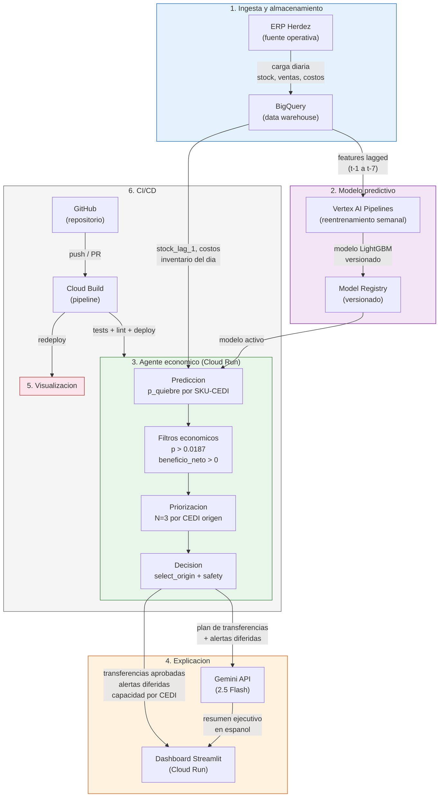
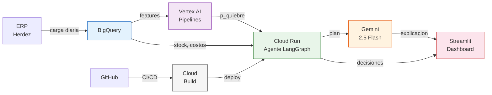

# Arquitectura GCP — Herdez Smart-Supply en Produccion

## Diagrama de servicios



> **Nota:** El diagrama detallado (arriba) es para lectura en documento.
> Para slides 1280x720, usar el diagrama simplificado (abajo) — renderizado
> verificado como legible. PNG disponible en `docs/presentation/diagram_simple.png`.

### Diagrama simplificado para slides (1280x720)



### Happy path: una alerta desde deteccion hasta decision

```
06:00 — Carga diaria                                         [~15 min]
  ERP Herdez → BigQuery: stock, ventas, costos del dia anterior
  Bottleneck: transformacion ETL + validacion de calidad

06:15 — Prediccion                                            [~5 min]
  Vertex AI (modelo LightGBM versionado) lee features lagged de BigQuery
  → genera p_quiebre para cada SKU-CEDI (20 combinaciones: 5 SKUs x 4 CEDIs)
  LightGBM es rapido: inferencia de 20 filas < 1 seg; el tiempo es overhead de pipeline

06:20 — Filtros economicos (Cloud Run: agente LangGraph)      [~1 min]
  Nodo 1 — generate_alerts:
    Filtra p > 0.0187 (umbral economico, regimen 53:1)
    Ejemplo: SKU Salsa-Verde en CEDI_Sur tiene p=0.72 → pasa

  Nodo 2 — evaluate_costs:
    costo_no_actuar = 0.72 × $15,000 × 5 dias = $54,000
    costo_transferir = $10.45 × max(deficit, 50) = $523
    beneficio_neto = $54,000 - $523 = $53,477 > 0 → pasa

06:21 — Priorizacion y asignacion                             [<1 min]
  Nodo 3 — prioritize:
    Ordena alertas por beneficio_neto descendente
    CEDI_Norte tiene capacidad (1/3 usada) y mayor excedente del SKU
    → select_origin elige CEDI_Norte como origen
    → unidades = min(deficit, excedente × 0.5) = 50

  Nodo 4 — decide:
    Gemini revisa el plan (puede ajustar via tools, raramente lo hace)

06:22 — Explicacion                                           [~1 min]
  Nodo 5 — explain:
    Gemini genera resumen en espanol:
    "Transferir 50 unidades de Salsa Verde de CEDI Norte a CEDI Sur.
     Probabilidad de quiebre: 72%. Ahorro esperado: $53,477 MXN.
     Capacidad restante CEDI Norte: 2/3 transferencias."
  Latencia dominada por llamada API a Gemini (~2-5 seg)

06:23 — Visualizacion                                         [instantaneo]
  Dashboard Streamlit muestra:
    - Tabla de alertas con decision (aprobada/diferida/sin_alerta)
    - Capacidad utilizada por CEDI origen
    - Explicacion del agente
```

**Desglose de tiempos por componente:**

| Paso | Servicio GCP | Tiempo estimado | Bottleneck |
|------|-------------|-----------------|------------|
| Carga diaria | BigQuery (ETL) | ~15 min | Extraccion ERP + validacion |
| Prediccion | Vertex AI Pipelines | ~5 min | Overhead de pipeline (inferencia < 1s) |
| Agente (nodos 1-3) | Cloud Run | <1 min | Computo puro Python, sin I/O |
| Revision LLM (nodo 4) | Gemini API | ~5 seg | Latencia API |
| Explicacion (nodo 5) | Gemini API | ~5 seg | Latencia API |
| Dashboard | Cloud Run (Streamlit) | Instantaneo | Ya desplegado, lee datos |
| **Total** | | **~23 min** | **ETL domina el 65% del tiempo** |

---

## Justificacion por servicio

### 1. BigQuery (Data Stack)

- **Que resuelve**: Almacenamiento centralizado del historico de
  inventarios, ventas y costos. Permite queries SQL sobre anos de
  datos sin gestionar infraestructura de base de datos.
- **Por que se eligio**: El prototipo usa DuckDB con sintaxis
  compatible con BigQuery por diseno (documentado en CLAUDE.md).
  La migracion es directa: mismas queries SQL, solo cambia el
  conector. BigQuery es serverless (zero ops) y escala a petabytes.
- **Alternativa descartada**: Cloud SQL (PostgreSQL managed).
- **Por que se descarto**: Cloud SQL requiere dimensionar instancias,
  gestionar conexiones, y pagar por servidor encendido 24/7.
  BigQuery cobra por query ejecutada — para un job diario a las
  06:00, el costo es ordenes de magnitud menor. Ademas, Cloud SQL
  no tiene integracion nativa con Vertex AI Pipelines.
- **Conexion con el prototipo**: El dataset de 60 dias (1,200 filas)
  es insuficiente para capturar estacionalidad mensual o de temporada
  alta (EDA, seccion 8: "se necesitarian 12-18 meses para ciclos
  estacionales"). BigQuery permite acumular anos de historico sin
  cambiar la arquitectura. Tambien, las features lagged (t-1 a t-7)
  requieren acceso rapido a ventanas temporales — BigQuery las
  resuelve con funciones analiticas nativas.

### 2. Vertex AI Pipelines (ML Stack)

- **Que resuelve**: Reentrenamiento automatizado del modelo LightGBM
  con nuevos datos, incluyendo: extraccion de features, entrenamiento,
  evaluacion con TimeSeriesSplit, y registro del modelo si supera
  metricas minimas.
- **Por que se eligio**: El pipeline de reentrenamiento ya existe
  como codigo Python (`src/ml/train.py`, `src/data/features.py`).
  Vertex AI Pipelines orquesta estos pasos como DAG con logging,
  retry y monitoreo, sin reescribir la logica.
- **Alternativa descartada**: Cloud Composer (Airflow managed).
- **Por que se descarto**: Cloud Composer requiere un entorno
  persistente (~$300-400 USD/mes minimo) para orquestar un job que
  corre una vez por semana. Vertex AI Pipelines es serverless: paga
  solo por el computo del entrenamiento. Para un pipeline semanal
  con dataset pequeno, Composer es sobredimensionado.
- **Conexion con el prototipo**: Los rankings de estrategias son
  estables con 60 dias (tasa_base > costo_quiebre > modelo en los
  5 folds). Pero en produccion con 200+ SKUs, nuevos CEDIs y
  estacionalidad, los patrones van a cambiar. El reentrenamiento
  continuo es lo que permite al modelo mejorar con mas datos —
  "con mas datos (12+ meses), el modelo deberia mejorar; las
  reglas no" (CLAUDE.md, narrativa central del proyecto).

### 3. Vertex AI Model Registry (ML Stack)

- **Que resuelve**: Versionado, metadata y rollback de modelos.
  Cada modelo entrenado se registra con: version, metricas
  (AUC-PR, costo/fold), features utilizadas, y fecha de
  entrenamiento.
- **Por que se eligio**: Integracion nativa con Vertex AI Pipelines
  y Cloud Run. El pipeline registra el modelo; Cloud Run lo consume
  por alias ("production"). Rollback es un cambio de alias, no un
  redespliegue.
- **Alternativa descartada**: Guardar .pkl en Cloud Storage
  manualmente.
- **Por que se descarto**: Los 3 bugs del proyecto demuestran que
  la trazabilidad es critica. Bug 1 (asimetria en select_origin)
  y Bug 3 (divergencia backtest-agente) pasaron desapercibidos
  porque no habia forma sistematica de comparar versiones del modelo
  y su pipeline de evaluacion. Un Model Registry fuerza la
  comparacion: "el modelo v3 tiene AUC-PR 0.47 y costo $1.02M/fold
  vs v2 con 0.45 y $1.05M/fold".
- **Conexion con el prototipo**: El prototipo reentrena por fold
  con TimeSeriesSplit (5 folds, `run_capacity_comparison`). En
  produccion, cada reentrenamiento semanal produce un modelo
  candidato que debe pasar evaluacion ANTES de reemplazar al activo.
  El Registry habilita este flujo de promocion.

### 4. Cloud Run + Gemini 2.5 Flash (Agente y LLM)

- **Que resuelve**: Ejecutar el agente LangGraph (5 nodos) como
  servicio HTTP stateless que recibe datos del dia y retorna
  transferencias aprobadas + explicacion.
- **Por que se eligio**: El agente es stateless por diseno — toda
  la logica vive en funciones puras de `costs_v2.py` (modulo con
  zero imports de LangGraph). Cloud Run escala a cero cuando no hay
  solicitudes (el agente corre 1 vez/dia) y escala horizontalmente
  si se agregan mas CEDIs. Gemini 2.5 Flash es la opcion con mejor
  balance latencia/costo para generacion de texto en espanol.
- **Alternativa descartada**: GKE (Kubernetes) para el agente,
  Gemini 1.5 Pro en lugar de 2.5 Flash.
- **Por que se descarto**: GKE requiere gestion de cluster, nodos
  y networking para un servicio que corre 23 minutos/dia. El overhead
  operativo no se justifica. Respecto al LLM: el brief original de
  la prueba tecnica especifica Gemini 1.5 Pro. Se eligio 2.5 Flash
  por tres razones: (1) el LLM no toma decisiones — solo explica
  decisiones ya tomadas por codigo determinista, por lo que
  razonamiento avanzado no agrega valor; (2) 2.5 Flash tiene ~3x
  menor latencia y costo que 1.5 Pro para generacion de texto;
  (3) el test de equivalencia decisional (Dia 3) confirmo que las
  decisiones son identicas con y sin LLM, asi que la calidad del
  modelo de lenguaje no afecta la calidad de las decisiones
  economicas. Si en produccion se requiriera razonamiento mas
  complejo (e.g. el LLM ajustando decisiones via tools), se puede
  migrar a Gemini Pro cambiando un parametro en `get_llm()`.
- **Conexion con el prototipo**: La restriccion N=3
  transferencias/dia/CEDI significa que el agente ejecuta maximo
  12 decisiones diarias. Cloud Run maneja esto con una sola
  instancia min-0. El test de equivalencia decisional (Dia 3)
  confirmo que las decisiones son identicas con y sin LLM — el
  servicio puede degradar graciosamente si Gemini no responde.

### 5. Cloud Run para Streamlit (UI)

- **Que resuelve**: Despliegue del dashboard existente sin modificar
  codigo. El Director de Supply Chain accede via navegador, sin
  instalar nada.
- **Por que se eligio**: El dashboard ya existe (`src/app/main.py`,
  390 lineas, 3 tabs). Cloud Run despliega contenedores Docker
  directamente. Streamlit tiene compatibilidad nativa con
  contenedores (usa un solo puerto HTTP).
- **Alternativa descartada**: App Engine, Streamlit Community Cloud.
- **Por que se descarto**: App Engine cobra por instancia-hora minima
  ($50-100 USD/mes) para un dashboard con <10 usuarios. Streamlit
  Community Cloud es gratuito pero no permite datos privados ni
  integracion con VPC. Cloud Run escala a cero y esta dentro del
  mismo proyecto GCP que el agente.
- **Conexion con el prototipo**: El dashboard lee parquets
  precomputados (`@st.cache_data`). En produccion, leeria de
  BigQuery directamente. La estructura de 3 tabs (Backtest, Alertas,
  Chat) se mantiene identica.

### 6. Cloud Build + GitHub Actions (CI/CD)

- **Que resuelve**: Pipeline automatizado que ejecuta tests, lint y
  deploy en cada push a main. Bloquea merges si los tests fallan.
- **Por que se eligio**: GitHub Actions para tests/lint (ya existe
  `pytest`, `ruff`, `mypy`). Cloud Build para build de imagen Docker
  y deploy a Cloud Run. La separacion permite que los tests corran
  en GitHub (gratis para repos publicos) y el deploy en GCP (con
  acceso a servicios privados).
- **Alternativa descartada**: Solo GitHub Actions (sin Cloud Build).
- **Por que se descarto**: GitHub Actions puede hacer deploy a Cloud
  Run, pero requiere configurar credenciales GCP como secrets y
  gestionar permisos IAM desde fuera del proyecto. Cloud Build esta
  dentro del proyecto GCP con permisos nativos, y su trigger de
  GitHub es nativo (sin secrets manuales).
- **Conexion con el prototipo**: Los 3 bugs detectados en auditorias
  manuales deberian haberse capturado con CI. El test
  `TestBacktestMatchesAgentDecisions` (Bug 3) y
  `TestByStockLag1NotStockActual` (Bug 2) existen como tests de
  regresion. En produccion, un merge que rompa la equivalencia
  backtest-agente no puede llegar a produccion.

### Tabla resumen

| Servicio | Problema que resuelve | Alternativa descartada | Razon del descarte |
|---|---|---|---|
| BigQuery | Historico escalable (anos de datos, SQL nativo) | Cloud SQL | Pago por servidor 24/7, sin integracion Vertex AI |
| Vertex AI Pipelines | Reentrenamiento semanal automatizado | Cloud Composer | $300+/mes para un job semanal; sobredimensionado |
| Model Registry | Versionado y rollback de modelos | .pkl en Cloud Storage | Sin trazabilidad; los 3 bugs exigen comparacion sistematica |
| Cloud Run + Gemini Flash | Agente stateless diario + explicaciones | GKE + Gemini Pro | Overhead de cluster para 23 min/dia; Pro 3x mas caro sin beneficio |
| Cloud Run (Streamlit) | Dashboard web sin infra persistente | App Engine | $50-100/mes minimo vs escala-a-cero; <10 usuarios |
| Cloud Build + GitHub Actions | CI/CD con tests de regresion | Solo GitHub Actions | Requiere secrets GCP manuales; Cloud Build tiene permisos nativos |

---

## Seguridad y gestion de secretos

### Secretos

- **GOOGLE_API_KEY** (Gemini): almacenada en **Secret Manager**.
  Cloud Run la consume como variable de entorno inyectada en deploy,
  nunca hardcodeada en imagen ni en repo. En el prototipo se lee
  de `.env` via `pydantic-settings` (`get_settings()`); en produccion,
  Secret Manager reemplaza el `.env` sin cambiar codigo.
- **Credenciales de BigQuery**: no se usan API keys. Cloud Run usa
  **Workload Identity** — la cuenta de servicio del contenedor tiene
  permisos IAM directos sobre los datasets de BigQuery. Zero
  credenciales en disco o variables de entorno.

### Identidad y permisos

- **Workload Identity Federation**: Cloud Run, Vertex AI y Cloud Build
  operan con cuentas de servicio dedicadas (principio de minimo
  privilegio). Cada servicio solo tiene los roles IAM que necesita:
  - Cloud Run (agente): `bigquery.dataViewer`, `aiplatform.user`,
    `secretmanager.secretAccessor`
  - Vertex AI Pipelines: `bigquery.dataViewer`, `aiplatform.admin`
    (para registrar modelos)
  - Cloud Build: `run.developer` (para deploy), `iam.serviceAccountUser`
- **GitHub → Cloud Build**: trigger autenticado via Cloud Build
  GitHub App (OAuth nativo), sin secrets de GCP en GitHub.

### Red

- Cloud Run y BigQuery estan en el mismo proyecto GCP. Si se
  requiere aislamiento, se puede configurar VPC connector para
  que Cloud Run acceda a BigQuery via red privada (sin exposicion
  publica).

---

## Mapeo prototipo → produccion

Cada componente del prototipo tiene un equivalente en produccion. La
tabla documenta que cambia, que se conserva, y por que.

| # | Componente | Prototipo (hoy) | Produccion (propuesta) | Que cambia | Justificacion |
|---|------------|-----------------|----------------------|------------|---------------|
| 1 | **Storage** | DuckDB local (`data/herdez.db`, ~1200 filas) | BigQuery (dataset `herdez_supply`) | Motor de consulta. La sintaxis SQL es compatible (DuckDB soporta dialecto BigQuery). Se agrega particionamiento por fecha y clustering por SKU/CEDI. | DuckDB no escala a multiples usuarios concurrentes ni a volumenes de 12+ meses con 200+ SKUs. BigQuery es serverless, sin infraestructura que mantener. |
| 2 | **ML Pipeline** | LightGBM entrenado localmente (`src/ml/train.py`), evaluacion manual con `TimeSeriesSplit` | Vertex AI Pipelines: reentrenamiento semanal automatizado, Model Registry para versionado, evaluacion automatica con metricas de produccion | Orquestacion y automatizacion. El modelo (LightGBM) y la estrategia de validacion (TimeSeriesSplit) se conservan identicos. Se agrega: reentrenamiento programado, registro de metricas por version, rollback automatico si AUC-PR cae. | El regimen 53:1 puede cambiar con nuevos SKUs o temporadas. Reentrenamiento continuo adapta el umbral. Con 60 dias el modelo es fragil; con 12+ meses en BigQuery, mejora. |
| 3 | **Agente economico** | LangGraph local (`src/agent/graph.py`), 5 nodos, ejecucion manual | Cloud Run (servicio stateless), mismo grafo LangGraph, trigger diario via Cloud Scheduler | Infraestructura de ejecucion. El grafo, los nodos deterministas y la logica de `costs_v2.py` se conservan sin cambios. Se agrega: endpoint HTTP, health checks, auto-scaling (0→1 instancia). | Con N=3 transferencias/CEDI/dia, el agente debe correr diariamente antes de la ventana operativa. Cloud Run permite ejecucion programada sin servidor permanente. |
| 4 | **LLM** | Gemini 2.5 Flash via API gratuita (10 RPM), `_MockLLM` como fallback | Gemini 2.5 Flash via API Enterprise (pay-per-use), sin cambio de modelo ni de rol | Tier de API (gratuita → Enterprise). El rol del LLM no cambia: revision y explicacion, NO decision. Los nodos 1-3 siguen siendo deterministas. Se agrega: SLA de disponibilidad, rate limits mayores, facturacion predecible. | La tier gratuita tiene limites de 10 RPM y sin SLA. Para operacion diaria con 4 CEDIs, se necesita disponibilidad garantizada. El fallback mock se conserva para resiliencia. |
| 5 | **Dashboard** | Streamlit local (`src/app/main.py`), 3 tabs, datos desde parquets locales | Streamlit en Cloud Run (o App Engine), misma app, datos desde BigQuery | Fuente de datos y hosting. La app Streamlit se conserva identica. Se cambia: lectura de parquets locales → consultas a BigQuery. Se agrega: autenticacion (IAP o Cloud Identity), URL publica con HTTPS. | Streamlit local no es accesible por el equipo de supply chain. Cloud Run permite acceso via navegador con autenticacion corporativa. |
| 6 | **CI/CD** | Manual (`pytest`, `ruff check`, `mypy`), commits manuales | Cloud Build + GitHub Actions: pipeline automatizado en cada push | Automatizacion de validacion. Los mismos comandos (`pytest`, `ruff`, `mypy`) se ejecutan automaticamente. Se agrega: build bloqueante (merge solo si CI pasa), deploy automatico a Cloud Run en merge a main. | Sin CI/CD, un cambio en `costs_v2.py` podria romper los filtros uniformes sin que nadie lo detecte. El pipeline automatizado previene regresiones como los 3 bugs del Dia 2. |
| 7 | **Monitoreo** | Logs locales (`logging` de Python), sin alertas | Cloud Logging + Cloud Monitoring: logs centralizados, alertas configurables | Observabilidad. Se conserva el uso de `logging`. Se agrega: dashboards de Cloud Monitoring (latencia del agente, errores, drift de metricas), alertas a Slack/email si el agente falla o si AUC-PR cae. | En produccion, un fallo silencioso del agente significa transferencias perdidas. A $53,333/FN, un dia sin deteccion cuesta mas que un mes de monitoreo. |
| 8 | **Validacion de calidad** | 3 tests de regresion locales (equivalencia backtest-agente, stock_lag_1, filtros uniformes), 48 tests totales | CI/CD que bloquea merges + monitoreo de drift en produccion | Donde y cuando se ejecuta la validacion. Los tests se conservan y se agregan: (1) CI bloquea merge si tests fallan, (2) monitoreo de drift: alerta si distribucion de features o prevalencia del target cambia >2σ respecto al entrenamiento, (3) validacion de consistencia agente-backtest en cada reentrenamiento. | Los 3 bugs del Dia 2 se detectaron por auditoria manual. En produccion, la deteccion debe ser automatica. El monitoreo de drift detecta cuando el modelo necesita reentrenamiento urgente (no solo el programado semanal). |

### Que se conserva sin cambios

- **Modelo ML**: LightGBM con features lagged. Misma arquitectura.
- **Logica economica**: `costs_v2.py` con filtros uniformes (p > 0.0187
  + beneficio_neto > 0). Misma funcion, mismos parametros.
- **Grafo del agente**: 5 nodos LangGraph, misma topologia.
- **Rol del LLM**: revision y explicacion, no decision.
- **Validacion temporal**: TimeSeriesSplit, nunca random split.

### Que cambia fundamentalmente

- **Escala**: de 5 SKUs / 4 CEDIs / 60 dias → 200+ SKUs / N CEDIs / 12+ meses.
- **Frecuencia**: de ejecucion manual → diaria automatizada.
- **Acceso**: de localhost → equipo de supply chain via navegador.
- **Resiliencia**: de "si falla, nadie se entera" → alertas automaticas.

---

## Estimacion de costos

Estimacion cualitativa para la operacion mensual del sistema en
produccion. Los rangos asumen el volumen del prototipo escalado a
200 SKUs / 15 CEDIs / ejecucion diaria. No son cotizaciones —
son ordenes de magnitud para evaluar viabilidad.

| Servicio | Uso estimado | Costo mensual (USD) | Notas |
|----------|-------------|-------------------|-------|
| **BigQuery** | ~10 GB almacenamiento, ~50 consultas/dia (agente + dashboard + reentrenamiento) | $5–20 | Primeros 10 GB gratis. Consultas on-demand: ~$5/TB escaneado. Volumen del dataset es pequeno. |
| **Vertex AI Pipelines** | 1 ejecucion semanal de reentrenamiento (~15 min en n1-standard-4) | $10–30 | LightGBM entrena en segundos. El costo es la VM del pipeline, no el entrenamiento. Model Registry es gratuito. |
| **Cloud Run (agente)** | 1 invocacion diaria (~30s), auto-scale 0→1 | $1–5 | Escala a cero cuando no hay invocacion. 2M requests/mes gratis. El agente es ligero (Python, sin GPU). |
| **Cloud Run (dashboard)** | ~100 requests/dia (equipo SC consultando), instancia minima | $5–15 | Streamlit consume mas memoria que el agente. Min 1 instancia si se quiere respuesta rapida. |
| **Gemini API** | ~50 llamadas/dia (4 CEDIs × ~12 alertas × 1 explicacion) | $5–15 | Gemini 2.5 Flash: ~$0.15/1M tokens input, ~$0.60/1M tokens output. Cada explicacion ~500 tokens. |
| **Cloud Build** | ~30 builds/mes (CI en cada PR + deploy en merge) | $0–5 | 120 min/dia gratis. Builds rapidos (~3 min: install + test + deploy). |
| **Secret Manager** | 2–3 secrets (API key, config), ~50 accesos/dia | $0 | 6 versiones activas gratis. Accesos: $0.03/10k. Insignificante. |
| **Cloud Monitoring** | Logs del agente + dashboard + alertas | $0–10 | Primeros 50 GB de logs gratis. Alertas basicas sin costo adicional. |

### Resumen de costos

| Concepto | Rango mensual (USD) |
|----------|-------------------|
| **Infraestructura GCP** | $26–100 |
| **Contingencia (+30%)** | $8–30 |
| **Total estimado** | **$34–130/mes** |

### Contexto de negocio: dos escenarios de ROI

El retorno del sistema depende de contra que se compare. Presentamos
ambos escenarios para que el argumento sea defendible independientemente
de lo que la audiencia asuma sobre la operacion actual de Herdez.

**Escenario A — Herdez no tiene sistema automatizado (reemplaza inaccion)**

| Metrica | Valor |
|---------|-------|
| Costo de inaccion total | $3,634,000 MXN/fold (~$200,000 USD) |
| Costo del sistema (modelo + agente + GCP) | $912,709 MXN/fold (mejor estrategia: tasa_base) |
| Ahorro vs inaccion | $2,587,343 MXN/fold (71%) |
| Costo infraestructura GCP | ~$100 USD/mes (~$2,000 MXN/mes) |
| Recuperacion de GCP | < 1 dia de operacion |

En este escenario, cualquier estrategia del sistema — incluso la mas
simple (fifo) — ahorra millones respecto a no hacer nada. La
infraestructura GCP es insignificante frente al ahorro.

**Escenario B — Herdez ya opera con priorizacion manual razonable**

Si el equipo de supply chain ya prioriza transferencias con algun
criterio (similar a by_costo_quiebre o by_tasa_base), el beneficio
del sistema no es $2.6M sino el delta marginal:

| Metrica | Valor |
|---------|-------|
| Mejor baseline heuristico (tasa_base) | $912,709 MXN/fold |
| Modelo ML con agente | $1,046,657 MXN/fold |
| Delta marginal del modelo vs mejor heuristica | +$133,948 MXN/fold (+14.7%) |

En este escenario, el modelo ML por si solo NO supera a la mejor
heuristica (es 3° de 7). Sin embargo, el sistema completo aporta
valor mas alla de la priorizacion:

1. **Automatizacion**: ejecucion diaria sin intervencion humana,
   eliminando el riesgo de dias sin revision.
2. **Safety checks**: `select_origin()` verifica que el CEDI origen
   no entre en riesgo, algo dificil de hacer manualmente con 200 SKUs.
3. **Volumen optimo**: calculo automatico de unidades a transferir
   basado en deficit proyectado, no estimacion a ojo.
4. **Explicabilidad**: cada decision tiene justificacion en espanol
   via Gemini, trazable y auditable.
5. **Escalabilidad**: de 5 SKUs / 4 CEDIs a 200+ SKUs / 15+ CEDIs
   sin aumentar el equipo de analisis.
6. **Plataforma de mejora**: con 12+ meses de datos en BigQuery,
   el modelo puede superar a las heuristicas (el prototipo opera
   con solo 60 dias).

| Metrica | Valor |
|---------|-------|
| Costo infraestructura GCP | ~$100 USD/mes (~$2,000 MXN/mes) |
| Valor de automatizacion + safety + escalabilidad | Dificil de cuantificar, pero > $2,000 MXN/mes |
| Recuperacion de GCP | Dias a semanas, dependiendo del baseline real de Herdez |

**Conclusion para ambos escenarios:** la infraestructura GCP ($34–130
USD/mes) es un costo trivial en ambos casos. La decision de Go/No-Go
no depende del costo de GCP sino del costo de personal para
implementar y mantener el sistema.

> **Nota:** Estos numeros NO incluyen costo de personal (ML engineer,
> DevOps) para implementar y mantener el sistema. La estimacion de
> equipo humano se aborda en la narrativa de negocio (presentacion,
> Slide 18).
